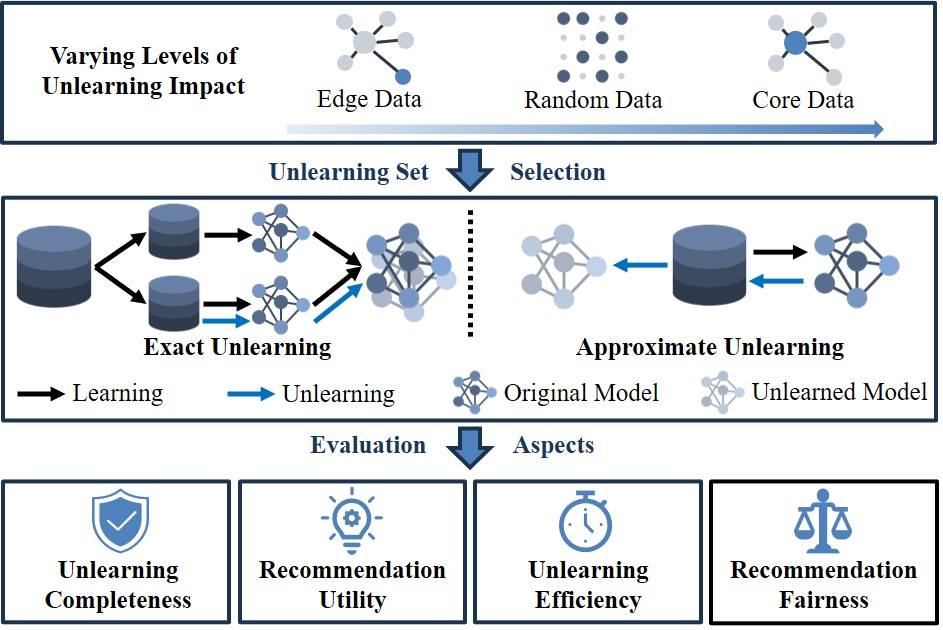

# <center> Recommendation Unlearning with Deeper Influence </center>

<div align="center">
  <a href="https://github.com/xiye7lai/CURE4Rec">
    
  </a>
  <a href="https://github.com/xiye7lai/CURE4Rec">
    
  </a>
  <a href="https://github.com/xiye7lai/CURE4Rec">
    
  </a>
</div>

<br>

<table align="center">
  <tr>
    <td align="center"> 
       
      <br>
      <em style="font-size: 18px;">  <strong style="font-size: 18px;">Figure 1:</strong> An illustration of CURE4Rec, a comprehensive benchmark tailored for evaluating recommendation unlearning methods. </em>
    </td>
  </tr>
</table>

---

## 📌 Overview

CURE4Rec provides a unified benchmark to evaluate different recommendation unlearning methods.  
We support:

- **Instance-based Unlearning** (Retrain, SISA, RecEraser, UltraRE)
- **Task Vector-based Unlearning** (Selective Unlearning)
- **Joint SVD-based Task Vector Unlearning**

---

## 📂 Code Structure

| Main File       | Purpose                                                       |
| --------------- | ------------------------------------------------------------- |
| `main.py`       | Instance-based unlearning (Retrain, SISA, RecEraser, UltraRE) |
| `main_task.py`  | Task Vector-based unlearning                                  |
| `main_task2.py` | Joint SVD Task Vector-based unlearning                        |

| Script               | Purpose                                                             |
| -------------------- | ------------------------------------------------------------------- |
| `run.sh`             | Run instance-based unlearning experiments                           |
| `run_param_tune.sh`  | Run Task Vector-based experiments (hyperparameter tuning)           |
| `run_param_tune2.sh` | Run Joint SVD Task Vector-based experiments (hyperparameter tuning) |

---

## ⚡ Quick Start

---

### **1️⃣ Instance-based Unlearning**

- **Main File:** `main.py`
- **Script:** `run.sh`
- **Supported Methods:** `retrain`, `sisa`, `receraser`, `ultrare`


./run.sh

또는

python main.py \
  --dataset ml-100k \
  --model wmf \
  --learn sisa \
  --deltype interaction \
  --delper 5 \
  --verbose 2


⸻

2️⃣ Task Vector-based Unlearning
	•	Main File: main_task.py
	•	Script: run_param_tune.sh
	•	Supported Methods: task_vector

./run_param_tune.sh

또는

python main_task.py \
  --dataset ml-100k \
  --learn task_vector \
  --delper 5 \
  --alpha 1.0 \
  --beta 1.5 \
  --rank_ratio 0.8 \
  --origin_model_path model_params/retrain/wmf_ml-100k_interaction_0.0/model.pth \
  --oracle_model_path model_params/retrain/wmf_ml-100k_interaction_5.0/model.pth


⸻

3️⃣ Joint SVD Task Vector-based Unlearning
	•	Main File: main_task2.py
	•	Script: run_param_tune2.sh
	•	Supported Methods: task_vector_joint

./run_param_tune2.sh

또는

python main_task2.py \
  --dataset ml-100k \
  --learn task_vector_joint \
  --delper 5 \
  --alpha 1.0 \
  --beta 1.5 \
  --rank_ratio 0.8 \
  --origin_model_path model_params/retrain/wmf_ml-100k_interaction_0.0/model.pth \
  --oracle_model_path model_params/retrain/wmf_ml-100k_interaction_5.0/model.pth


⸻

📌 Notes
	•	All logs are saved in log/
	•	Trained model parameters are saved in model_params/
	•	Supported datasets: ml-100k, ml-1m, gowalla, adm
	•	Supported models: wmf, bpr, dmf, gmf, nmf

⸻

📊 Method Comparison

Method Type	Main File	Run Script	Key Feature
Instance-based	main.py	run.sh	Retraining or group-based instance unlearning
Task Vector-based	main_task.py	run_param_tune.sh	Parameter-space editing with task vector
Joint SVD Task Vector-based	main_task2.py	run_param_tune2.sh	Low-rank joint vector approach for task vector
```
